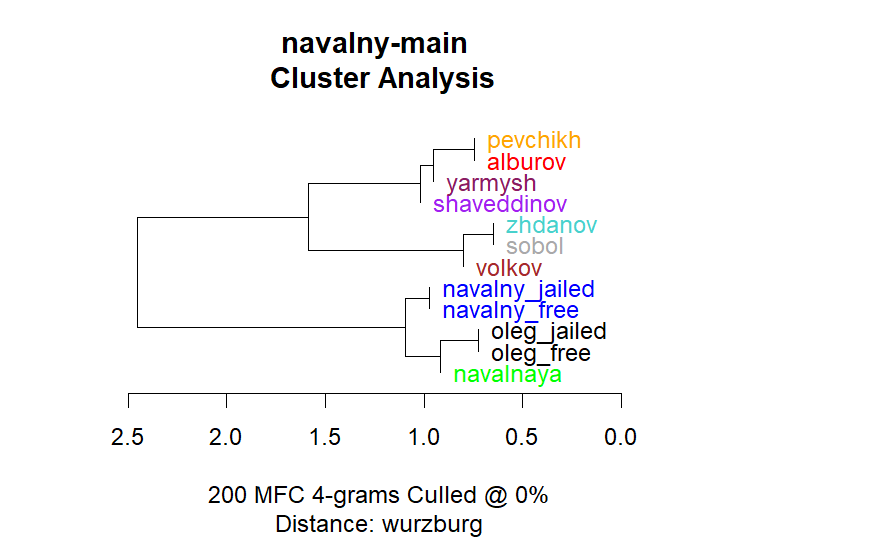

# navalny-NLP

Our NLP analysis aimed to investigate the “Navalny doesn't write his public texts from jail himself” narrative. The additional aim was to compare the stylistic differences in Alexey's jailed/free texts with the differences between similar texts of his brother, Oleg Navalny, who was also a political prisoner.

## Project Overview
In August 2023, an online discussion emerged regarding the authorship of texts published in the name of Russian political prisoner Alexey Navalny. This project aimed to conduct a stylometric analysis of Navalny's texts during his imprisonment, comparing them with his texts written when free and those authored by other members of his Anti-Corruption Foundation (ACF/FBK) team. Our work built upon an existing Navalny+FBK text archive (https://github.com/norpadon/navalny), with two significant additions:

1. Collection and inclusion of texts by Navalny's brother, Oleg Navalny, also a political prisoner from 2014-2018, to examine differences between texts written by Alexey Navalny in prison and free, and those of Oleg Navalny in the same periods.

2. A meticulous selection of Alexey Navalny's texts to ensure the corpus only contains his writings, excluding repetitions and texts clearly authored by his team, which could impact authorship analysis.

The project was conducted during the last week of August, 2023.

## Data Collection and Preprocessing
The project involved scraping social media posts and other public texts by Alexey and Oleg Navalny. Python scripts were used to collect, clean, and standardize these texts, ensuring consistency and quality for analysis. The preprocessing steps involved removing duplicates, irrelevant content, and ensuring authenticity of authorship.

## Analysis Methodology
Stylometric analysis was employed to investigate the authorship of the texts. We follow the approach described in https://github.com/DanilSko/navalny that involves examining writing style characteristics to differentiate between authors and periods of authorship (imprisonment vs. freedom).

## Reuslts and Conclusions

1. **Navalny's Authorship**: There is a noticeable heterogeneity between Navalny_jailed and Navalny_free samples, indicating a potential stylistic shift post-imprisonment. And yet, Navalny_jailed and Navalny_free are still more similar to each other than to the texts of other authors.

2. **FBK Influence**: While Maria Pevchikh shows stylistic affinities with the jailed samples, the analysis does not conclusively point to her as the author.

3. **Oleg Navalny's Texts**: Oleg’s texts, both jailed and free, exhibit grouping and stylistic relationships similar to those of Alexey’s, suggesting consistent authorial traits regardless of the incarceration.

  
   

## Limitations:

* The FBK team members have had close interactions over many years, naturally leading to an adoption of each other’s communication styles in both speech and writing. It's plausible that team members unconsciously emulate Alexey Navalny's style, seeing him as their leader. Such communicational and stylistical interweavings are beyond the scope of the current analysis.

* A meticulous verification to exclude evidently non-original texts (such as reposts or team messages in Alexey's social networks) was conducted solely for the texts of Alexey and Oleg Navalny. For other authors, we relied on the previously compiled archive. Further scrutiny of the FBK members' corpus could refine the differentiation of authorship further.

* The existing corpus of texts by Oleg Navalny and Yulia Navalnaya was insufficient for a comprehensive analysis. It would be sensible to explore other sources of their texts beyond social networks, such as Oleg Navalny's book, to enrich the analysis

## Technical Requirements

* Python (for data collection and preprocessing)

* R (for stylometric analysis)

* Libraries: Pandas, Requests, CSV, Regex (Python); Stylometry (R)

## Usage Instructions

1. Clone the repository and install required libraries.

2. Run Python notebook to scrape and preprocess data.

3. Execute the R script for stylometric analysis.

## License and Contributions

This project is open-source. Contributions, suggestions, and discussions are welcome to enhance the analysis and interpretations.
